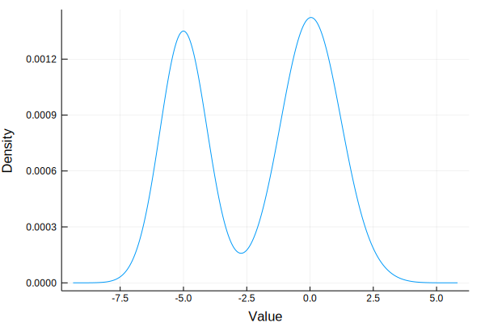
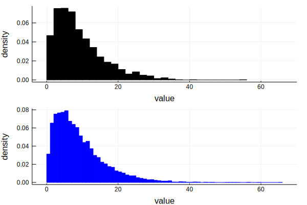

# Examples

First, load the necessary packages:

```julia
using UncertainData, Distributions, KernelDensity, Plots
```

## Theoretical distributions

### A uniformly distributed uncertain value

Consider the following contrived example. We've measure a data value with a poor instrument 
that tells us that the value lies between `-2` and `3`. However, we but that we know nothing 
more about how the value is distributed on that interval. Then it may be reasonable to 
represent that value as a uniform distribution on `[-2, 3]`.

To construct an uncertain value following a uniform distribution, we use the constructor 
for theoretical distributions with known parameters 
(`UncertainValue(distribution, params...)`). 

The uniform distribution is defined by its lower and upper bounds, so we'll provide 
these bounds as the parameters.

```julia
u = UncertainValue(Uniform, 1, 2)

# Plot the estimated density
bar(u, label = "", xlabel = "value", ylabel = "probability density")
```


### A normally distributed uncertain value

A situation commonly encountered is to want to use someone else's data from a publication. 
Usually, these values are reported as the mean or median, with some associated uncertainty. 
Say we want to use an uncertain value which is normally distributed with mean `2.1` and 
standard deviation `0.3`.

Normal distributions also have two parameters, so we'll use the two-parameter constructor 
as we did above. 

```julia
u = UncertainValue(Normal, 2.1, 0.3)

# Plot the estimated density
bar(u, label = "", xlabel = "value", ylabel = "probability density")
```


### Other distributions 

You may define uncertain values following any of the 
[supported distributions](uncertainvalues_theoreticaldistributions.md). 

## Kernel density estimated distributions

One may also be given a a distribution of numbers that's not quite normally distributed. 
How to represent this uncertainty? Easy: we use a kernel density estimate to the distribution.

Let's define a complicated distribution which is a mixture of two different normal 
distributions, then draw a sample of numbers from it.

```julia
M = MixtureModel([Normal(-5, 0.5), Normal(0.2)])
some_sample = rand(M, 250)
```

Now, pretend that `some_sample` is a list of measurements we got from somewhere. 
KDE estimates to the distribution can be defined implicitly or explicitly as follows:

```julia 
# If the only argument to `UncertainValue()` is a vector of number, KDE will be triggered.
u = UncertainValue(rand(M, 250)) 

# You may also tell the constructor explicitly that you want KDE. 
u = UncertainValue(UnivariateKDE, rand(M, 250))
```

Now, let's plot the resulting distribution. _Note: this is not the original mixture of 
Gaussians we started out with, it's the kernel density estimate to that mixture!_

```julia 
# Plot the estimated distribution.
plot(u, xlabel = "Value", ylabel = "Probability density")
```



## Theoretical distributions fitted to empirical data

One may also be given a dataset whose histogram looks a lot like a theoretical
distribution. We may then select a theoretical distribution and fit its
parameters to the empirical data.

Say our data was a sample that looks like it obeys Gamma distribution.

```julia
# Draw a 2000-point sample from a Gamma distribution with parameters α = 1.7 and θ = 5.5
some_sample = rand(Gamma(1.7, 5.5), 2000)
```

To perform a parameter estimation, simply provide the distribution as the first 
argument and the sample as the second argument to the `UncertainValue` constructor.

```julia
# Take a sample from a Gamma distribution with parameters α = 1.7 and θ = 5.5 and 
# create a histogram of the sample.
some_sample = rand(Gamma(1.7, 5.5), 2000)

p1 = histogram(some_sample, normalize = true,
    fc = :black, lc = :black,
    label = "", xlabel = "value", ylabel = "density")

# For the uncertain value representation, fit a gamma distribution to the sample. 
# Then, compare the histogram obtained from the original distribution to that obtained 
# when resampling the fitted distribution
uv = UncertainValue(Gamma, some_sample)

# Resample the fitted theoretical distribution
p2 = histogram(resample(uv, 10000), normalize = true,
    fc = :blue, lc = :blue,
    label = "", xlabel = "value", ylabel = "density")

plot(p1, p2, layout = (2, 1), link = :x)
```

As expected, the histograms closely match (but are not exact because we estimated
the distribution using a limited sample).


